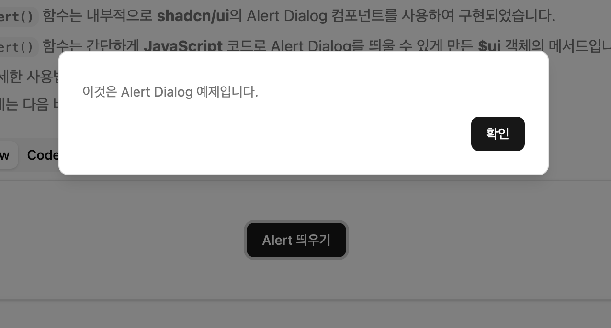

# Alert Dialog
* **Alert Dialog** 컴포넌트는 사용자의 작업 흐름을 중단시키고 중요한 메시지를 전달하며, 사용자의 응답을 요구하는 모달 대화 상자입니다. 주로 삭제 확인 프롬프트나 오류 메시지 확인과 같은 상황에서 사용됩니다. 포커스 자동 관리, 키보드 단축키 지원, 스크린 리더 지원 등의 접근성 기능을 제공합니다.
* **entec-react-assets**프로젝트에서 **Alert Dialog**를 사용하는 방법은 **$ui.alert()** 함수를 호출하여 간단하게 사용할 수 있습니다.
:::info <span class="admonition-title">Alert Dialog</span> 실제 구동 예제 확인해보기
👉 [Alert Dialog 작동 예제 이동](http://example.com/entec/react_assets/ex/#/example/components/alert-dialog)
:::


import Tabs from '@theme/Tabs';
import TabItem from '@theme/TabItem';

<Tabs>
  <TabItem value="Preview" label="Preview image" default>
    
  

  </TabItem>
  <TabItem value="Code" label="Code">
    ```tsx showLineNumbers
    import type { IComponent } from '@/app/types/common';
    import { useState } from 'react';
    // highlight-start
    import { Button } from '@/app/components/ui';
    // highlight-end

    interface ISampleAlertDialogPageProps {
      //
    }

    const SampleAlertDialogPage: IComponent<ISampleAlertDialogPageProps> = () => {

      // Alert 띄우기 버튼 클릭 handler
      // highlight-start
      const handlerOpenAlertDialog = () => {
        $ui.alert('이것은 Alert Dialog 예제입니다.');
      };
      // highlight-end

      return (
        <>
          {/* highlight-start */}
          <Button onClick={handlerOpenAlertDialog}>Alert 띄우기</Button>
          {/* highlight-end */}
        </>
      );
    };

    SampleAlertDialogPage.displayName = 'SampleAlertDialogPage';
    export default SampleAlertDialogPage;
    ```
  </TabItem>
</Tabs>


## 사용법
---

* **$ui.alert()** 함수는 내부적으로 **shadcn/ui**의 `Alert Dialog` 컴포넌트와 `TailwindCSS`를 사용하여 구현 되었습니다.
* **$ui** 객체는 **entec-react-assets**에서 제공하는 전역 객체이므로 `$ui.alert()` 를 사용하기 위하여 따로 import를 하지 않아도 됩니다.
* 화면의 특정 이벤트를 통해서 **JavaScript** 코드로 `$ui.alert()`를 호출하여 Alert Dialog를 띄웁니다. 위 예제는 **Button**을 클릭해서 **Alert Dialog**를 띄운 방식의 예제입니다.
* [👉 **$ui.alert()** 사용 가이드 이동](../../assets-api/global-object/global-obj-ui.md#uialert)
 


## API
---
**entec-react-assets**의 **Alert Dialog** 컴포넌트는 **[shadcn/ui](https://ui.shadcn.com/docs/components/alert-dialog)** 의 Alert Dialog 컴포넌트를 래핑(wrap)한 컴포넌트 세트입니다.

### $ui.alert() API
* **Alert Dialog**를 띄우는 방법으로 **$ui.alert()** 함수를 사용합니다.
* 👉 [$ui.alert() 함수 API 확인하기](../../assets-api/global-object/global-obj-ui#uialert)

<!-- 
### Alert Dialog(shadcn/ui) 컴포넌트 API
| Component                | 설명                                                         |
| :----------------------- | :---------------------------------------------------------- |
| `AlertDialog`            | Alert Dialog의 최상위 래퍼. 모든 하위 컴포넌트를 포함.      |
| `AlertDialogTrigger`     | 대화 상자를 여는 트리거 버튼.                               |
| `AlertDialogContent`     | 대화 상자의 실제 콘텐츠 영역.                               |
| `AlertDialogHeader`      | 제목과 설명을 포함하는 헤더 영역.                           |
| `AlertDialogTitle`       | 대화 상자의 제목. 스크린 리더에 의해 안내됨.                |
| `AlertDialogDescription` | 대화 상자의 설명. 스크린 리더에 의해 안내됨.                |
| `AlertDialogFooter`      | 액션 버튼들을 포함하는 푸터 영역.                           |
| `AlertDialogAction`      | 확인/계속 버튼. 대화 상자를 닫고 액션을 수행.               |
| `AlertDialogCancel`     | 취소 버튼. 대화 상자를 닫음.                                |

### AlertDialog Props

| Props           | Type      | Default | 설명                                                                                  |
| :-------------- | :-------- | :------ | :------------------------------------------------------------------------------------ |
| `open`          | boolean   | 없음    | 제어 방식. 대화 상자의 열림 상태를 제어합니다.                                        |
| `defaultOpen`   | boolean   | false   | 비제어 초기값. 대화 상자의 초기 열림 상태를 설정합니다.                               |
| `onOpenChange`  | function  | 없음    | 열림 상태 변경 이벤트 콜백. `(open: boolean) => void`                                 |

### AlertDialogTrigger Props

| Props     | Type    | Default | 설명                                                                                  |
| :-------- | :------ | :------ | :------------------------------------------------------------------------------------ |
| `asChild` | boolean | false   | 자식 요소를 렌더링할지 여부. true일 경우 자식 요소를 트리거로 사용합니다.             |

### AlertDialogContent Props

| Props                 | Type     | Default | 설명                                                                                  |
| :-------------------- | :------- | :------ | :------------------------------------------------------------------------------------ |
| `onOpenAutoFocus`     | function | 없음    | 열릴 때 포커스가 이동할 때 호출되는 콜백 함수.                                       |
| `onCloseAutoFocus`    | function | 없음    | 닫힐 때 포커스가 이동할 때 호출되는 콜백 함수.                                       |
| `onEscapeKeyDown`     | function | 없음    | Esc 키를 눌렀을 때 호출되는 콜백 함수.                                               |
| `onPointerDownOutside`| function | 없음    | 대화 상자 외부를 클릭했을 때 호출되는 콜백 함수.                                     |

### AlertDialogAction Props

| Props     | Type    | Default | 설명                                                                                  |
| :-------- | :------ | :------ | :------------------------------------------------------------------------------------ |
| `asChild` | boolean | false   | 자식 요소를 렌더링할지 여부.                                                          |

### AlertDialogCancel Props

| Props     | Type    | Default | 설명                                                                                  |
| :-------- | :------ | :------ | :------------------------------------------------------------------------------------ |
| `asChild` | boolean | false   | 자식 요소를 렌더링할지 여부.                                                          |

### AlertDialogTitle Props

| Props     | Type    | Default | 설명                                                                                  |
| :-------- | :------ | :------ | :------------------------------------------------------------------------------------ |
| `asChild` | boolean | false   | 자식 요소를 렌더링할지 여부.                                                          |

### AlertDialogDescription Props

| Props     | Type    | Default | 설명                                                                                  |
| :-------- | :------ | :------ | :------------------------------------------------------------------------------------ |
| `asChild` | boolean | false   | 자식 요소를 렌더링할지 여부.                                                          |


## 예제
---
:::info <span class="admonition-title">Alert Dialog</span> 실제 구동 예제 확인해보기
👉 [Alert Dialog 작동 예제 이동](http://example.com/entec/react_assets/ex/#/example/components/alert-dialog)
:::

### 기본 사용법

```tsx
<AlertDialog>
  <AlertDialogTrigger asChild>
    <Button variant="destructive">삭제하기</Button>
  </AlertDialogTrigger>
  <AlertDialogContent>
    <AlertDialogHeader>
      <AlertDialogTitle>정말로 삭제하시겠습니까?</AlertDialogTitle>
      <AlertDialogDescription>
        이 작업은 되돌릴 수 없습니다.
      </AlertDialogDescription>
    </AlertDialogHeader>
    <AlertDialogFooter>
      <AlertDialogCancel>취소</AlertDialogCancel>
      <AlertDialogAction>삭제</AlertDialogAction>
    </AlertDialogFooter>
  </AlertDialogContent>
</AlertDialog>
```

### 제어 방식 (Controlled)

```tsx
const [open, setOpen] = useState(false);

<AlertDialog open={open} onOpenChange={setOpen}>
  <AlertDialogTrigger asChild>
    <Button>열기</Button>
  </AlertDialogTrigger>
  <AlertDialogContent>
    <AlertDialogHeader>
      <AlertDialogTitle>제목</AlertDialogTitle>
      <AlertDialogDescription>설명</AlertDialogDescription>
    </AlertDialogHeader>
    <AlertDialogFooter>
      <AlertDialogCancel onClick={() => setOpen(false)}>취소</AlertDialogCancel>
      <AlertDialogAction onClick={() => {
        // 액션 수행
        setOpen(false);
      }}>확인</AlertDialogAction>
    </AlertDialogFooter>
  </AlertDialogContent>
</AlertDialog>
```

### 커스텀 액션 버튼

```tsx
<AlertDialog>
  <AlertDialogTrigger asChild>
    <Button>열기</Button>
  </AlertDialogTrigger>
  <AlertDialogContent>
    <AlertDialogHeader>
      <AlertDialogTitle>제목</AlertDialogTitle>
      <AlertDialogDescription>설명</AlertDialogDescription>
    </AlertDialogHeader>
    <AlertDialogFooter>
      <AlertDialogCancel asChild>
        <Button variant="outline">취소</Button>
      </AlertDialogCancel>
      <AlertDialogAction asChild>
        <Button variant="destructive">삭제</Button>
      </AlertDialogAction>
    </AlertDialogFooter>
  </AlertDialogContent>
</AlertDialog>
``` -->


## 변경 내역
---

* 2025-10-22 최초 생성.

