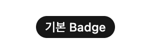
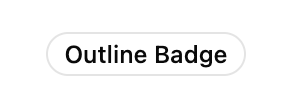
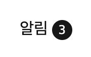

# Badge
**Badge** 컴포넌트는 작은 라벨이나 상태 표시를 위해 사용되는 컴포넌트입니다. 주로 텍스트, 아이콘, 또는 다른 요소 옆에 배치되어 추가 정보나 상태를 시각적으로 강조하여 표시합니다.
:::info <span class="admonition-title">Badge</span> 실제 구동 예제 확인해보기
👉 [Badge 작동 예제 이동](http://example.com/entec/react_assets/ex/#/example/components/badge)
:::

import Tabs from '@theme/Tabs';
import TabItem from '@theme/TabItem';

<Tabs>
  <TabItem value="Preview" label="Preview image" default>
    
  

  </TabItem>
  <TabItem value="Code" label="Code">
    ```tsx showLineNumbers
    import type { IComponent } from '@/app/types/common';
    // highlight-start
    import { Badge } from '@/app/components/ui';
    // highlight-end

    interface ISampleBadgePageProps {
      //
    }

    const SampleBadgePage: IComponent<ISampleBadgePageProps> = () => {
      return (
        <>
          {/* highlight-start */}
          <Badge>Badge</Badge>
          <Badge className="h-5 min-w-5 rounded-full px-1 font-mono tabular-nums">8</Badge>
          <Badge
            className="h-5 min-w-5 rounded-full px-1 font-mono tabular-nums"
            variant="destructive"
          >
            99
          </Badge>
          {/* highlight-end */}
        </>
      );
    };

    SampleBadgePage.displayName = 'SampleBadgePage';
    export default SampleBadgePage;
    ```
  </TabItem>
</Tabs>


## 사용법
---

* 애플리케이션 공통 컴포넌트 영역(`@/app/components/ui`)에서 **Badge** 컴포넌트를 가져옵니다.
  ```tsx
  import { Badge } from '@/app/components/ui';
  ```
* 화면 **jsx** 영역에 **Badge** 컴포넌트를 구성하여 사용합니다.
  ```tsx
  <Badge>라벨</Badge>
  ```


## API
---
**entec-react-assets**의 **Badge** 컴포넌트는 **[shadcn/ui](https://ui.shadcn.com/)** 의 Badge 컴포넌트를 래핑(wrap)한 컴포넌트입니다.

| Component | 설명                                                         |
| :-------- | :---------------------------------------------------------- |
| `Badge`   | 상태나 라벨을 표시하는 Badge 컴포넌트.                      |

### Badge Props

| Props     | Type                                                         | Default | 설명                                                                                  |
| :-------- | :----------------------------------------------------------- | :------ | :------------------------------------------------------------------------------------ |
| `variant` | "default" \| "secondary" \| "destructive" \| "outline"      | "default" | Badge의 스타일 변형을 지정합니다. "default"는 기본 스타일,<br />"secondary"는 보조 스타일,<br />"destructive"는 경고/오류 스타일,<br />"outline"은 외곽선 스타일입니다. |
| `asChild` | boolean                                                      | false   | `true`로 설정하면 Badge 자체 DOM 요소를 렌더링하는 대신, 직접 작성한 자식 요소를 렌더링하고 Badge의 모든 props를 자식 요소에 전달합니다.                                                          |


## 예제
---

### 기본 사용법

```tsx
<Badge>기본 Badge</Badge>
```

### Secondary variant

```tsx
<Badge variant="secondary">Secondary Badge</Badge>
```

### Destructive variant (경고/오류)

```tsx
<Badge variant="destructive">Destructive Badge</Badge>
```

### Outline variant

```tsx
<Badge variant="outline">Outline Badge</Badge>
```

### 텍스트와 함께 사용

```tsx
<div>
  <span>알림</span>
  <Badge>3</Badge>
</div>
```

### 아이콘과 함께 사용

```tsx
<Badge>
  <Icon name="House" />
  Badge
</Badge>
```


## 변경 내역
---

* 2025-10-22 최초 생성.

