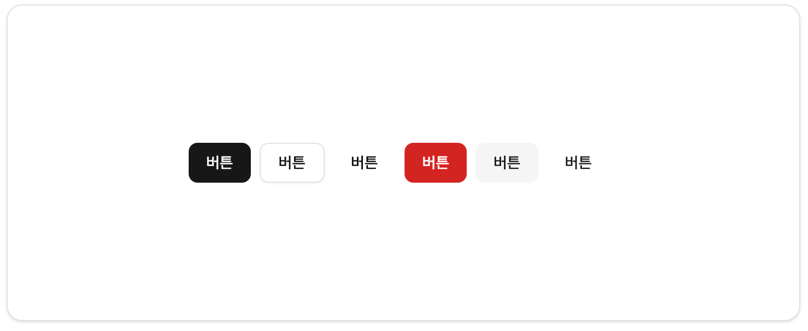
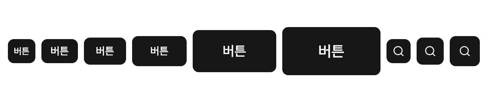
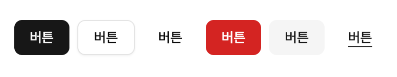
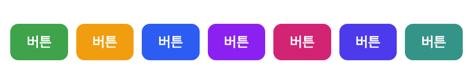
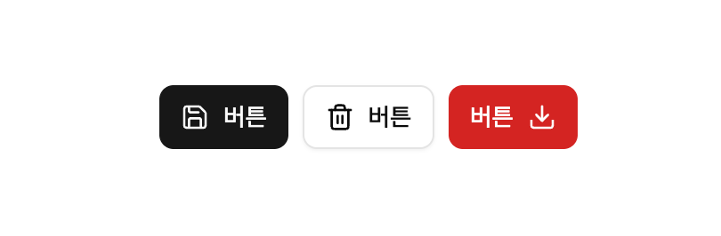

# Button
**Button** 컴포넌트는 UI 전반적으로 한번의 클릭으로 작업을 수행하는 컴포넌트입니다. Modal Dialog나 Forms, Cards, Toolbar 등의 다양한 UI에서 사용될 수 있습니다.
:::info <span class="admonition-title">Button</span> 실제 구동 예제 확인해보기
👉 [Button 작동 예제 이동](http://example.com/entec/react_assets/ex/#/example/components/button)
:::


import Tabs from '@theme/Tabs';
import TabItem from '@theme/TabItem';

<Tabs>
  <TabItem value="Preview" label="Preview image" default>
    
    
    
  </TabItem>
  <TabItem value="Code" label="Code">
    ```tsx showLineNumbers
    import type { IComponent } from '@/app/types/common';
    // highlight-start
    import { Button } from '@/app/components/ui';
    // highlight-end

    interface ISamplePageProps {
      //
    }

    const SamplePage: IComponent<ISamplePageProps> = () => {
      return (
        <>
          // highlight-start
          <Button
            variant="default"
            className="mr-2"
          >
            버튼
          </Button>
          <Button
            variant="outline"
            className="mr-2"
          >
            버튼
          </Button>
          <Button
            variant="ghost"
            className="mr-2"
          >
            버튼
          </Button>
          <Button
            variant="destructive"
            className="mr-2"
          >
            버튼
          </Button>
          <Button
            variant="secondary"
            className="mr-2"
          >
            버튼
          </Button>
          <Button
            variant="link"
            className="mr-2"
          >
            버튼
          </Button>
          // highlight-end
        </>
      );
    };

    SamplePage.displayName = 'SamplePage';
    export default SamplePage;
    ```
  </TabItem>
</Tabs>


## 사용법
---
* 애플리케이션 공통 컴포넌트 영역(`@/app/components/ui`)에서 **Button** 컴포넌트를 가져옵니다.
  ```tsx
  import { Button } from '@/app/components/ui';
  ```
* 화면 **jsx** 영역에 **Button** 컴포넌트 코드를 작성하여 사용합니다.
  ```tsx
  <Button>Click me!</Button>
  ```


## API
---
**entec-react-assets**의 **Button** 컴포넌트는 **[shadcn/ui](https://ui.shadcn.com/)** 의 **Button** 컴포넌트를 감싸는 래퍼 컴포넌트입니다. 내부에는 **button** html element를 사용합니다.
| Props     | Type                         | 설명   |
| :-------- | :--------------------------- | :---- |
| `variant` | "default" \| "outline" \| "ghost" \| "destructive" \| "secondary" \| "link" | Button의 스타일 변형을 지정합니다. "default"는 기본 스타일, |
| 색상관련 `variant` | "success" \| "warning" \| "info" \| "purple" \| "pink" \| "indigo" \| "teal" | Button스타일의 변형에 색깔관련 추가된 값입니다. |
| `size`    | "default" \| "xs" \| "sm" \| "lg" \| "xl" \| "2xl" \| "icon" \| "icon-sm" \| "icon-lg" | Button의 사이즈. |
| `asChild` | boolean                 | `true`로 설정하면, `Button`이 자체 DOM 요소를 렌더링하는 대신, 직접 작성한 자식 요소를 렌더링하고 `Button`의 모든 props를 자식 요소에 전달합니다. |


## 예제
---
:::info <span class="admonition-title">Button</span> 실제 구동 예제 확인해보기
👉 [Button 작동 예제 이동](http://example.com/entec/react_assets/ex/#/example/components/button)
:::

### 이벤트 처리
* 모든 버튼 컴포넌트는 onClick 이벤트 함수를 통해서 이벤트를 처리할 수 있습니다.
```tsx
import { Button } from '@/app/components/ui';

function SamplePage() {
  // 버튼 클릭 이벤트 처리 함수
  // highlight-start
  const handlerClickButton = () => {
    $ui.alert('clicked!');
  };
  // highlight-end

  return (
    <div>
      // highlight-start
      <Button onClick={handlerClickButton}>
        버튼 클릭!
      </Button>
      // highlight-end
    </div>
  );
}
```

### Size
* 사이즈관련 **9가지 size** 속성값 : "xs", "sm", "default", "lg", "xl", "2xl", "icon-sm", "icon", "icon-lg".
* **"icon-*"** 속성값은 아이콘 전용 버튼일 때 사용합니다.

```tsx
<Button size="xs">버튼</Button>
<Button size="sm">버튼</Button>
<Button size="default">버튼</Button>
<Button size="lg">버튼</Button>
<Button size="xl">버튼</Button>
<Button size="2xl">버튼</Button>
<Button size="icon-sm">
  <Icon name="Search" />
</Button>
<Button size="icon">
  <Icon name="Search" />
</Button>
<Button size="icon-lg">
  <Icon name="Search" />
</Button>
```

### variant (기본)
* Button 컴포넌트의 **variant** 속성으로 기본적인 (`default, destructive, outline, secondary, ghost, link`) 속성값을 제공합니다.



```tsx
<Button variant="default">버튼</Button>
<Button variant="outline">버튼</Button>
<Button variant="ghost">버튼</Button>
<Button variant="destructive">버튼</Button>
<Button variant="secondary">버튼</Button>
<Button variant="link">버튼</Button>
```

### variant (색깔관련)
* Button 컴포넌트의 **variant** 속성으로 기본적인 (`default, destructive, outline, secondary, ghost, link`) 속성값 외에도 **7가지 색상관련 variant**속성을 제공합니다.

* 색상관련 7가지 variant 속성값 : **"success", "warning", "info", "purple", "pink", "indigo", "teal"**

```tsx
<Button variant="success">버튼</Button>
<Button variant="warning">버튼</Button>
<Button variant="info">버튼</Button>
<Button variant="purple">버튼</Button>
<Button variant="pink">버튼</Button>
<Button variant="indigo">버튼</Button>
<Button variant="teal">버튼</Button>
```


### 아이콘과 레이블이 있는 버튼
* 아이콘과 레이블이 있는 버튼은 버튼의 시작이나 끝에 아이콘을 추가하여 시각적 강조를 더할 수 있습니다.

```tsx
<Button>
  <Icon name="Save" />
  버튼
</Button>
<Button variant="outline">
  <Icon name="Trash2" />
  버튼
</Button>
<Button variant="destructive>
  버튼
  <Icon name="Download" />
</Button>
```


## 변경 내역
---
* 2025-10-22 최초 생성.