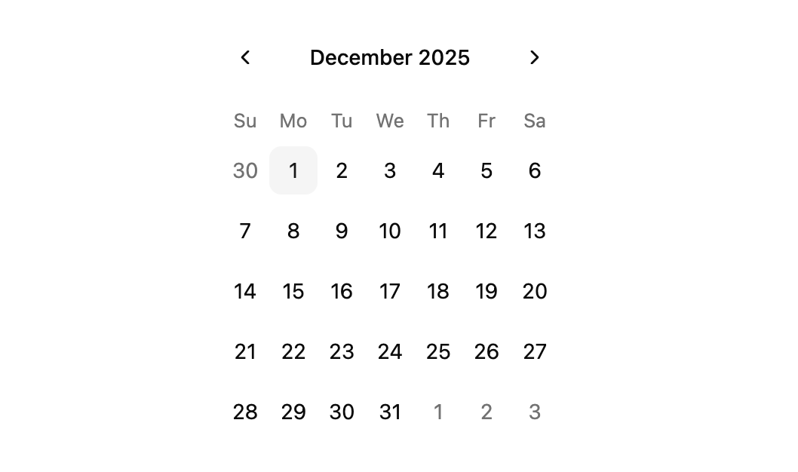
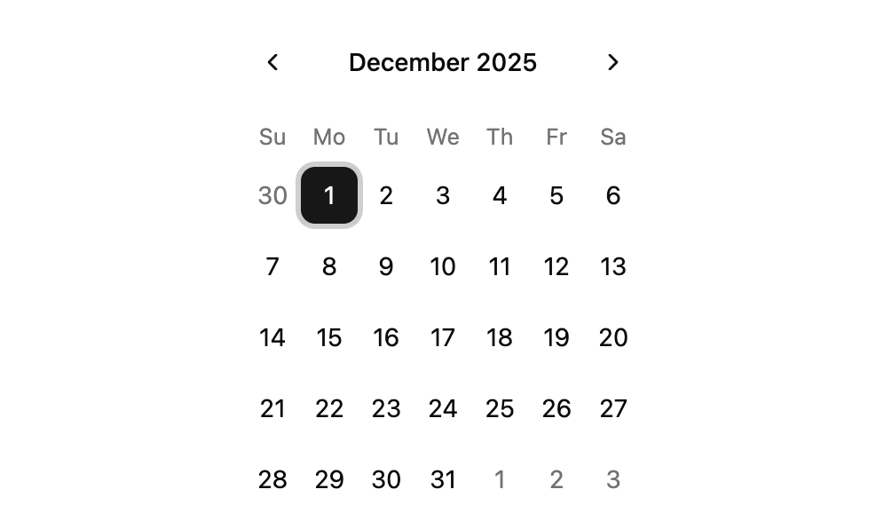
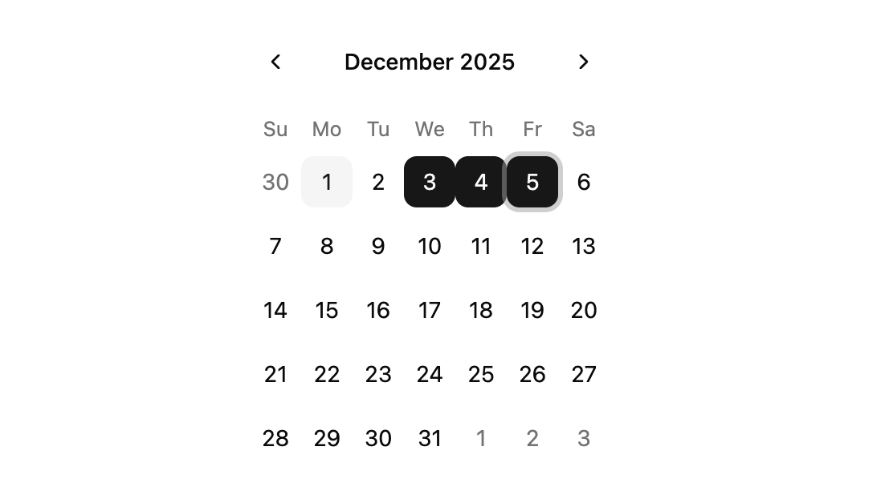
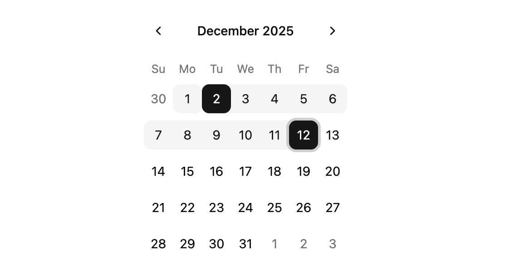
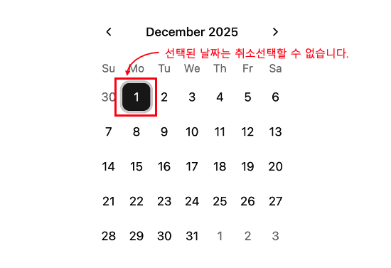

# Calendar
**Calendar** 컴포넌트는 사용자가 날짜를 입력하고 편집할 수 있는 달력 컴포넌트입니다.
:::info <span class="admonition-title">Calendar</span> 실제 구동 예제 확인해보기
👉 [Calendar 작동 예제 이동](http://example.com/entec/react_assets/ex/#/example/components/calendar)
:::


import Tabs from '@theme/Tabs';
import TabItem from '@theme/TabItem';

<Tabs>
  <TabItem value="Preview" label="Preview image" default>
    
    
    
  </TabItem>
  <TabItem value="Code" label="Code">
    ```tsx showLineNumbers
    import type { IComponent } from '@/app/types/common';
    // highlight-start
    import { Calendar } from '@/app/components/ui';
    // highlight-end

    interface ISamplePageProps {
      //
    }

    const SamplePage: IComponent<ISamplePageProps> = () => {
      return (
        <>
          // highlight-start
          <Calendar mode="single" />
          // highlight-end
        </>
      );
    };

    SamplePage.displayName = 'SamplePage';
    export default SamplePage;
    ```
  </TabItem>
</Tabs>


## 사용법
---
* 애플리케이션 공통 컴포넌트 영역(`@/app/components/ui`)에서 **Calendar** 컴포넌트를 가져옵니다.
  ```tsx
  import { Calendar } from '@/app/components/ui';
  ```
* 화면 **jsx** 영역에 **Calendar** 컴포넌트 코드를 작성하여 사용합니다.
  ```tsx
  <Calendar mode="single" />
  ```


## API
---
**entec-react-assets**의 **Calendar** 컴포넌트는 **[shadcn/ui](https://ui.shadcn.com/)** 의 **Calendar** 컴포넌트를 감싸는 래퍼 컴포넌트입니다. 
| Props     | Type                         | 설명   |
| :-------- | :--------------------------- | :---- |
| `mode` | "single" \| "multiple" \| "range" | 날짜 선택의 규칙.<br />**single**: 단일 날짜만 선택 가능.<br />**multiple**: 여러개의 개별 날짜를 선택할 수 있습니다.<br />**range**: 연속된 날짜 범위를 선택할 수 있습니다. |
| `disabled` | Matcher \| Matcher[] | 선택할 수 없는 비활성화된 날짜를 입력합니다. |
| `selected` | Date \| Date[] \| DateRange \| undefined | 선택한 날짜 값. |
| `required` | boolean | true 로 설정하면, 이미 선택한 날짜는 다시 취소 선택할 수 없습니다. |
| `onSelect` | OnSelectHandler | 날짜를 선택하면 해당 함수로 이벤트 콜백이 발생합니다. |
| `min` | number | mode="multiple, range"일 때 선택할 수 있는 최소 날짜 수입니다. |
| `max` | number | mode="multiple, range"일 때 선택할 수 있는 최대 날짜 수입니다. |
| `excludeDisabled` | boolean | mode="range"일 때 비활성화된 날짜를 범위에서 제외합니다. |

### props 데이터 타입 정의
```tsx
/**
 * 특정 날짜와 일치하는 값이나 함수.
 *
 * @example
 *   // 주말 및 특정 공휴일과 일치
 *   const matcher: Matcher = [
 *     { dayOfWeek: [0, 6] }, // Weekends
 *     { from: new Date(2023, 11, 24), to: new Date(2023, 11, 26) }, // Christmas
 *   ];
 */
type Matcher =
  | boolean
  | ((date: Date) => boolean)
  | Date
  | Date[]
  | DateRange
  | DateBefore
  | DateAfter
  | DateInterval
  | DayOfWeek;

/**
 * 날짜 범위입니다. 범위의 끝 부분이 포함됩니다.
 *
 * @example
 *   // 2019년 2월 2일부터 2월 5일까지의 날짜
 *   const matcher: DateRange = {
 *     from: new Date(2019, 1, 2),
 *     to: new Date(2019, 1, 5),
 *   };
 */
type DateRange = { from: Date | undefined; to?: Date | undefined };

/**
 * 지정된 날짜 이전의 모든 날짜와 일치합니다(해당 날짜 제외).
 *
 * @example
 *   // Match days before February 2, 2019 2019년 2월 2일 이전 날짜들.
 *   const matcher: DateBefore = { before: new Date(2019, 1, 2) };
 */
type DateBefore = { before: Date };

/**
 * 지정된 날짜 이후의 모든 날짜와 일치합니다(해당 날짜 제외).
 *
 * @example
 *   // 2019년 2월 2일 이후 날짜들
 *   const matcher: DateAfter = { after: new Date(2019, 1, 2) };
 */
type DateAfter = { after: Date };

/**
 * 날짜 간격입니다. DateRange와 달리, 범위의 끝은 포함되지 않습니다.
 *
 * @example
 *   // 2019년 2월 2일부터 2월 5일까지의 날짜
 *   const matcher: DateInterval = {
 *     after: new Date(2019, 1, 2),
 *     before: new Date(2019, 1, 5),
 *   };
 */
type DateInterval = { before: Date; after: Date };

/**
 * 주중의 지정된 요일과 일치합니다(예: 일요일은 0, 토요일은 6).
 *
 * @example
 *   // Match Sundays
 *   const matcher: DayOfWeek = { dayOfWeek: 0 };
 *   // Match weekends
 *   const matcher: DayOfWeek = { dayOfWeek: [0, 6] };
 */
type DayOfWeek = { dayOfWeek: number | number[] };

/**
 * 선택 mode가 설정될 때 `onSelect` 콜백에 대한 공유 핸들러 type입니다.
 *
 * @example
 *   const handleSelect: OnSelectHandler<Date> = (
 *     selected,
 *     triggerDate,
 *     modifiers,
 *     e,
 *   ) => {
 *     console.log("Selected:", selected);
 *     console.log("Triggered by:", triggerDate);
 *   };
 *
 * @template T - 선택한 항목의 유형.
 * @callback OnSelectHandler
 * @param {T} selected - 이벤트 발생 후 선택된 항목입니다.
 * @param {Date} triggerDate - 이벤트가 트리거된 날짜입니다. 일반적으로 클릭하거나 상호작용한 날짜입니다.
 * @param {Modifiers} modifiers - 이벤트와 관련된 수정자입니다.
 * @param {React.MouseEvent | React.KeyboardEvent} e - 이벤트 객체.
 */
type OnSelectHandler<T> = (
  selected: T,
  triggerDate: Date,
  modifiers: Modifiers,
  e: React.MouseEvent | React.KeyboardEvent,
) => void;

/**
 * 달력의 특정 날짜와 일치하는 수정자를 나타냅니다.
 *
 * @example
 *   const modifiers: Modifiers = {
 *     today: true, // 오늘이 그날.
 *     selected: false, // 날짜가 선택되지 않았다.
 *     weekend: true, // 주말을 위한 사용자 정의 수정자
 *   };
 *
 */
type Modifiers = Record<string, boolean>;
```


## 예제
---
:::info <span class="admonition-title">Calendar</span> 실제 구동 예제 확인해보기
👉 [Calendar 작동 예제 이동](http://example.com/entec/react_assets/ex/#/example/components/calendar)
:::

### `mode="single"`
* 단일 선택 모드
* **mode** 속성을 `"single"`로 설정하면, 한 번에 하나의 날짜만 선택할 수 있습니다.

```tsx
<Calendar mode="single" />
```


### `mode="multiple"`
* 다중 선택 모드
* **mode** 속성을 `"multiple"`로 설정하면, 여러 날짜를 선택할 수 있습니다.

```tsx
<Calendar mode="multiple" />
```


### `mode="range"`
* 범위 선택 모드
* **mode** 속성을 `"range"`로 설정하면, 연속적인 날짜 범위를 선택할 수 있도록합니다 

```tsx
<Calendar mode="range" />
```


### required 속성
* **required** 속성을 설정하면, 사용자가 선택한 날짜를 선택 취소할 수 없도록 합니다.

```tsx
<Calendar mode="single" required />
```


### min, max (선택 가능한 날짜 제한)
* **다중모드(multiple, range)** 일 때만 사용가능하며, **min, max**속성을 사용하여 선택 가능한 날짜의 수를 제한합니다.
```tsx
<Calendar mode="multiple" min={2} max={5} />
```
<span class="text-green-bold">&#8251; **required**속성을 설정하면 선택된 범위가 선택 취소되지 않도록 보장합니다.</span>


### disabled (날짜 비활성화)
* 특정 날짜를 비활성화하려면 **disabled** 속성을 사용합니다. 비활성화된 날짜는 선택할 수 없습니다.
* **disabled**속성은 `Matcher` 타입의 값을 할당할 수 있습니다.
* `Matcher`타입은 다음과 같이 여러가지 값을 혀용합니다.

| 허용 타입           | 설명                    |
| :------------ | :--------------------- |
| boolean       | 모든 날짜를 비활성화 합니다.   |
| Date          | 특정 날짜와 일치합니다.   |
| Date[]        | 날짜 배열의 모든 날짜와 일치합니다.   |
| DateRange [👉type참조](./calendar-component#props-데이터-타입-정의)    | 시작 및 종료 날짜를 포함한 다양한 날짜와 일치합니다.   |
| DateBefore [👉type참조](./calendar-component#props-데이터-타입-정의)    | 특정 날짜 이전의 모든 날짜와 일치합니다(해당 날짜 제외).   |
| DateAfter [👉type참조](./calendar-component#props-데이터-타입-정의)     | 특정 날짜 이후의 모든 날짜와 일치합니다(해당 날짜 제외).   |
| DateInterval [👉type참조](./calendar-component#props-데이터-타입-정의)  | 두 날짜 사이의 날짜를 일치시킵니다(시작 및 종료 날짜 제외).   |
| DayOfWeek [👉type참조](./calendar-component#props-데이터-타입-정의)     | 주중의 특정 요일과 일치합니다(예: 일요일은 0, 토요일은 6).   |
| (date: Date) => boolean | 주어진 날짜가 조건과 일치하면 true를 반환하는 함수입니다.   |
| Matcher[] [👉type참조](./calendar-component#props-데이터-타입-정의) | 위에 나열된 매처의 배열입니다.   |

* **disabled** 속성값에 대한 다양한 사용법
  ```tsx
  // 모든 날짜 비활성화
  <Calendar disabled />

  // 특정 날짜 비활성화
  <Calendar disabled={new Date(2023, 9, 1)} />

  // 날짜 배열 비활성화
  <Calendar disabled={[new Date(2023, 9, 1), new Date(2023, 9, 2)]} />

  // 날짜 범위 비활성화
  <Calendar disabled={{ from: new Date(2023, 9, 1), to: new Date(2023, 9, 5) }} />

  // 특정 요일 비활성화
  <Calendar disabled={{ dayOfWeek: [0, 6] }} /> // disable weekends

  // 특정 날짜 이전의 날짜 비활성화
  <Calendar disabled={{ before: new Date(2023, 9, 1) }} />

  // 특정 날짜 이후의 날짜 비활성화
  <Calendar disabled={{ after: new Date(2023, 9, 5) }} />

  // 두 날짜 사이의 날짜 비활성화
  <Calendar disabled={{ before: new Date(2023, 9, 1), after: new Date(2023, 9, 5) }} />
  ```
* **주말 비활성화**  
  주말을 비활성화하려면 `dayOfWeek` Matcher를 사용합니다. 여기서 0는 Sunday이고 6는 Saturday입니다.
  ```tsx
  <Calendar disabled={{ dayOfWeek: [0, 6] }} />
  ```

* **excludeDisabled** 속성 사용  
`range`모드 에서는 비활성화된 날짜가 기본적으로 선택된 범위에 포함됩니다. 비활성화된 날짜를 범위에서 제외하려면 **excludeDisabled** 속성을 사용합니다. 비활성화된 날짜를 선택하면 범위가 재설정됩니다.
  ```tsx
  <Calendar
    mode="range"
    // 주말 비활성화
    disabled={{ dayOfWeek: [0, 6] }}
    // 비활성화된 날짜가 포함된 경우 범위 재설정
    excludeDisabled
  />
  ```

## 변경 내역
---
* 2025-12-01 최초 생성.