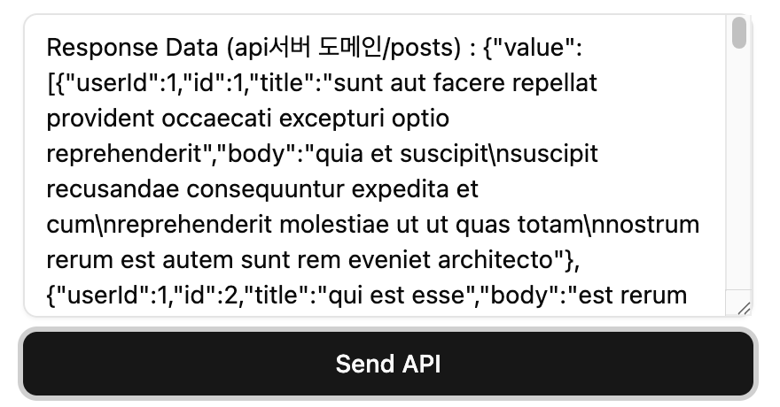

# REST API 호출하기

:::info
* 화면 컴포넌트에서 REST API를 호출하고 결과 데이터를 활용하기 위하여 **useAPI** hook을 사용하면, 비동기 데이터를 가져오고 State에 데이터를 저장합니다.
* 전역 State에 데이터를 저장하는 방법으로 현재는 **Redux-Toolkit**을 활용하고 있다. 하지만 상황에 따라 내부적으로 **[Zustand](https://zustand-demo.pmnd.rs/)**, **[Tanstack Query(react-query)](https://tanstack.com/query/latest)** 등의 라이브러리로 변경될 수도 있습니다.
:::


## 화면 컴포넌트에서 REST API를 호출하고 데이터 활용하는 방법
---

각 업무(domain)의 화면 컴포넌트에서 **entec-react-assets**에서 제공하는 **useAPI** hook으로 **REST API**를 호출하고 결과 데이터를 활용하는 방법을 순서대로 설명합니다.

### account(계좌)업무 폴더 구조
* 개발해야할 업무가 "**계좌(account)**" 업무라고 가졍 했을 때 다음과 같이 폴더구조를 구성하고, 그 하위 구조를 만듭니다.
  - **account** 업무 폴더가 생성되면 하위 폴더로 <span class="text-blue-normal">api, components, common, pages, router, store, types</span> 폴더를 가질 수 있습니다. 물론 사용되지 않는 폴더는 없어도 상관없습니다.
  - 폴더 구성에 대한 자세한 설명은 [개발구조및규칙](../config/dev-convention#entec-react-assets-폴더-구조) 가이드를 참조하세요.
  ```sh
  # 내가 작업할 업무가 "계좌(account)" 업무라고 가정한다면
  # 아래와 같은 기본 구조를 가진다.
  src
    ├─ ...
    ├─ ...
    ├─ domains
    │  ├─ ...
    │  ├─ account # account 업무 폴더를 생성
    │  │  ├─ api
    │  │  │  └─ url.ts
    │  │  ├─ components
    │  │  │  └─ AccountList.tsx # 계좌 리스트 컴포넌트(가정)
    │  │  ├─ pages
    │  │  │  ├─ AccountIndex.tsx  # 계좌메인화면(가정)
    │  │  │  └─ AccountUsage.tsx  # 계좌이용내역화면(가정)
    │  │  ├─ router
    │  │  │  └─ index.tsx
    │  │  ├─ store
    │  │  │  └─ index.ts
    │  │  └─ types
    │  │     └─ index.ts
    │  └─ ...
  ```


### `api/url.ts` 파일
* `api/url.ts` 파일은 REST API의 **url**을 모아놓은 파일입니다.
* 사용해야할 API url이 https://app.domain.com/api/v1/search 라고 가정했을 때 도메인(https://app.domain.com)은 빼고 하위 url만 입력합니다.
* 도메인(https://app.domain.com)은 추후 공통 영역(공통 개발자)에서 따로 설정합니다.
* API 이름은 **대문자**로 입력합니다.
  ```ts showLineNumbers
  // api/url.ts파일
  // TEST 라는 api를 사용한다고 가정.

  // url의 타입을 선언
  export type TUrl = (typeof url)[keyof typeof url];

  const url = {
    TEST: '/api/v1/search',
    // 필요한 api url을 이곳에 계속 등록할 수 있습니다.
  } as const;
  export default url;
  ```

### `store/index.ts` 파일
* `store/index.ts`파일은 REST API의 action을 생성하는 파일입니다.
* `url.ts`파일에 생성한 TEST API를 사용하여 다음 코드와 같이 test Action을 만듭니다.
  ```ts showLineNumbers
  import type { IActionObject, IRootState } from '@/app/types/store';
  import url from '@/domains/account/api/url';

  // action을 등록할 때 똑같이 여기도 한 줄 입력합니다.
  export interface IAccountStore<T = IRootState> {
    test: T;
  }

  // Account Action 객체 ==============================================
  // 생성할 Store state의 이름을 정하고, 값으로 actionType과 url을 입력한다.
  // API호출이 아닌 경우에는 url을 입력 하지 않아도 된다.
  // actionType은 '{업무도메인 store이름}/{action이름}' 조합으로 생성합니다.
  const accountAction: IAccountStore<IActionObject> = {
    test: { actionType: 'accountStore/test', url: url.TEST },
    // ... 추가 action을 입력
  } as const;

  export default accountAction;
  ```
  :::info 설명
  * `import url from '@/domains/account/api/url';` 이전에 생성한 url을 가져옵니다.
  * `export interface IAccountStore<T = IRootState> {}` Action의 구조를 타입(typescript)으로 설정한 부분, 타입명은 각 업무에 맞게 자유롭게 작성합니다. **action**이 하나 생성될 때 똑같이 타입도 하나 생성합니다.
  * `const accountAction: IAccountStore<IActionObject> = {` action 타입(IAccountStore)을 `IAccountStore<IActionObject>` 형태로 연결합니다.
  * `test: { actionType: 'accountStore/test', url: url.TEST },` test Action을 한 줄 생성합니다.
    * **action 객체**는 **actionType**과 **url**로 이루어져 있습니다.
    * **actionType**은 `/src/shared/store/app-store-redux.ts`파일에 연결한 **store명**과 위에 입력한 **action이름**을 "/"로 조합하여 생성합니다. ex) "accountStore/test"
    * **url**은 `api/url.ts`파일에 생성한 url을 가져와서 추가합니다 ex) url.TEST
    * 만약 REST API를 사용하지 않고 그냥 **전역 상태 관리를 위한 데이터만 저장**, 사용할 경우에는 **url**을 입력하지 않습니다.
  * `export default accountAction;` 생성된 account업무의 accountAction을 export default 합니다.
  :::


### `store/index.ts`에 생성한 action을 App 전역 store에 연결
* 최초 **account**업무 생성 시 한번만 열결하면 됩니다.
* `/src/shared/store/app-store-redux.ts` 파일에 생성한 account 액션을 연결 해야합니다.
* `/src/shared/store/app-store-redux.ts` 파일을 열고 다음과 같이 추가 입력합니다.
  ```ts showLineNumbers
  import { setReducer } from '@/app/store/store-redux';

  // 계좌업무(account) store를 가져와서
  // highlight-start
  import accountStore from '@/domains/account/store';
  // highlight-end

  // APP Root store ------------------------
  const appRootReducer = (): any => {
    return setReducer({
      appRootStore: {
        appRootStateEx: { actionType: 'appRootStore/appRootStateEx' },
        appRouteMeta: { actionType: 'appRootStore/appRouteMeta' },
        appMenuList: { actionType: 'appRootStore/appMenuList' },
        appLayout: { actionType: 'appRootStore/appLayout' },
      },
      // 가져온 계좌업무 store를 아래쪽에 추가합니다.
      // highlight-start
      accountStore,
      // highlight-end
    });
  };

  export default () => {
    return appRootReducer();
  };
  ```
  :::info 설명
  * 위에서 연결한 accountStore는 이름을 자유롭게 사용해도 상관없습니다.
  * ⭐ 이렇게 정해진 이름은 나중에 **actionType명**으로 사용 되므로 기억하고 있어야 합니다.
  :::


### 화면 컴포넌트에서 사용해 보기
* **useAPI** hook을 사용하여 REST API를 호출하고 결과 데이터를 활용해봅니다.
```tsx showLineNumbers
// /src/domains/account/pages/AccountIndex.tsx

import type { IComponent } from '@/app/types/common';
import { JSX } from 'react';
import { useEffect } from 'react';
// useAPI 훅 함수를 가져온다.
// highlight-start
import { useAPI } from '@/app/hooks';
// highlight-end

interface IAccountIndexProps {
  test?: string;
}

const AccountIndex: IComponent<IAccountIndexProps> = (): JSX.Element => {
  // useAPI훅을 사용하며 파라미터에는 이미 생성한 actionType을 입력한다.
  // highlight-start
  const { data, fetch } = useAPI('accountStore/test');
  // highlight-end
  
  // api 호출 버튼 클릭 handler
  // highlight-start
	const handlerCallAPI = () => {
		fetch({ option: { method: 'get' } });
	};
  // highlight-end

  return (
    <>
      <Textarea
        value={`Response Data : ${JSON.stringify(data)}`}
        className="h-60"
        placeholder="Response Data (api서버 도메인/api/v1/search)"
      />
      // highlight-start
      <Button onClick={handlerCallAPI}>Send API</Button>
      // highlight-end
    </>
  );
};

AccountIndex.displayName = 'AccountIndex';
export default AccountIndex;
```


:::info API호출 또는 전역 상태값 저장을 위한 <span class="admonition-title">useAPI</span> 훅에 대하여
* REST API호출과 상태값을 저장을 위한 전역 공통 Hook(useAPI)을 제공한다.
* **useAPI**를 import하여 가져온다.
```js
import { useReduxAPI } from '@/app/store';
```
* **useAPI** 사용 부분
```js
const { data: searchData, fetch: fetchSearchData } = useAPI('accountStore/test');
```
* 파라미터에는 이미 생성한 actionType을 입력한다.
* **useAPI** 함수는 object를 리턴한다.
  - **첫번째(searchData)** : response data (변수명은 이와같이 별칭을 사용할 수 있으며, 자유롭게 원하는 이름으로 정한다.)
  - **두번째(fetchSearchData)** : 함수이며 API를 호출할 때 사용한다. (함수명은 이와같이 별칭을 사용할 수 있으며, 자유롭게 원하는 이름으로 정한다.)
```js
// API를 호출하여 데이터를 비동기로 가져온다.
fetchSearchData({ option: { method: 'get' } });
// 별칭을 사용하지 않을 때는 다음과 같이 fetch함수를 그대로 사용
// fetch({ option: { method: 'get' } });
```
* API를 호출하여 데이터를 가지온다. 파라미터로는 옵션 객체를 사용한다. 사용법은 아래에서 설명.
:::