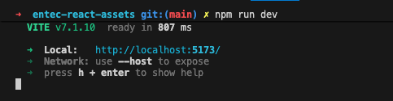
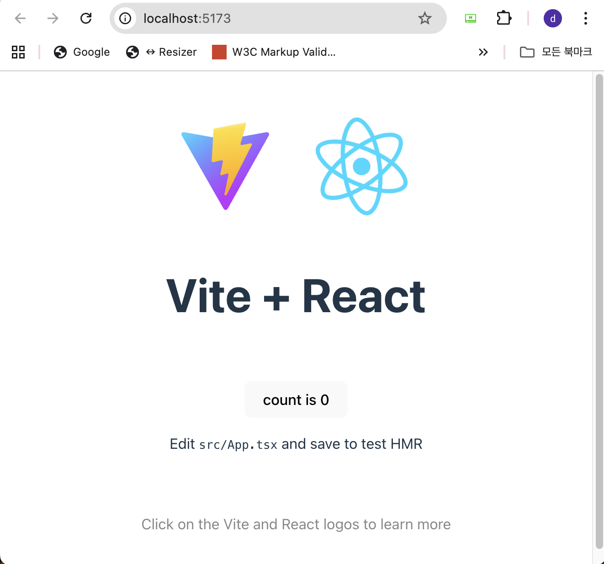

# entec-react-assets 설치

이 문서는 **entec-react-assets** 프로젝트를 로컬 개발 환경에 설치하고 실행하는 방법을 단계별로 안내합니다.


## 목차
---

1. [전제 조건](#전제-조건)
2. [시스템 요구사항](#시스템-요구사항)
3. [프로젝트 클론](#프로젝트-클론)
4. [의존성 설치](#의존성-설치)
5. [개발 서버 실행](#개발-서버-실행)


## 전제 조건
---

**entec-react-assets** 프로젝트를 설치하기 전에 다음 사항을 확인하세요:

### 필수 소프트웨어

- **Node.js**: 버전 20.0 이상이 설치되어 있어야 합니다
- **npm**: Node.js와 함께 설치되며, 버전 10.0 이상 권장
- **Git**: 소스 코드를 클론하기 위해 필요합니다
- **코드 에디터**: VSCode 또는 다른 IDE (선택사항)
- **Chrome Browser**: Chrome 브라우저 및 확장프로그램이 설치되어 있어야 합니다

### 접근 권한

:::info <span class="admonition-title">Git 레포지토리 접근 권한</span>
- **레포지토리 URL**: [http://aaaaa/bbbbbb/entec-react-assets.git](http://aaaaa/bbbbbb/entec-react-assets.git)
- 개발 코드를 내려받기 위해서는 **Git 계정 및 레포지토리 접근 권한**이 필요합니다
- 권한이 없는 경우 프로젝트 담당자에게 접근 권한을 요청하세요
:::


## 시스템 요구사항
---

### 최소 요구사항

| 항목 | 최소 버전 | 권장 버전 |
|------|----------|----------|
| Node.js | 20.0.0 | 20.x LTS 이상 |
| npm | 10.0.0 | 최신 버전 |
| Git | 2.0.0 | 최신 버전 |
| 운영체제 | Windows 10, macOS 10.15 | 최신 버전 |

### 시스템 확인

다음 명령어로 현재 시스템 환경을 확인할 수 있습니다.

```bash
# Node.js 버전 확인
node --version

# npm 버전 확인
npm --version

# Git 버전 확인
git --version
```

예상 출력:
```bash
node --version
# v20.x.x 이상

npm --version
# 10.x.x 이상

git --version
# git version 2.x.x 이상
```


## 프로젝트 클론
---

### 1단계: 작업 디렉토리 생성

로컬 PC에 프로젝트를 저장할 작업 폴더를 생성합니다. `frontend-react`라는 폴더명은 상황에 맞게 자유롭게 정하면됩니다.

```bash
# Windows 예시 (C:\my\ 디렉토리 기준)
mkdir frontend-react
cd frontend-react

# macOS/Linux 예시
mkdir -p ~/projects/frontend-react
cd ~/projects/frontend-react
```

:::tip
프로젝트 경로에 한글이나 공백이 포함되지 않도록 주의하세요. 이는 일부 빌드 도구에서 문제를 일으킬 수 있습니다.
:::

### 2단계: Git 레포지토리 클론

생성한 작업 폴더에서 Git을 사용하여 프로젝트를 클론합니다.

```bash
git clone http://aaaaa/bbbbbb/entec-react-assets.git
```

클론이 완료되면 `entec-react-assets` 폴더가 생성됩니다.

### 3단계: 프로젝트 디렉토리로 이동

```bash
cd entec-react-assets
```

### 4단계: 프로젝트 구조 확인

클론된 프로젝트의 기본 구조를 확인합니다:

```bash
# Windows
dir

# macOS/Linux
ls -la
```

디렉토리 구조:
```ls
//...
@types
src
  ├─ App.tsx
  ├─ main.tsx
  ├─ vite-env.d.ts
  ├─ app
  │  ├─ api
  │  ├─ common
  │  ├─ components
  │  ├─ router
  │  ├─ store
  │  └─ types
  ├─ assets
  │  ├─ styles
  │  ├─ fonts
  │  └─ images
  ├─ domains // 모든 업무 파일들이 모여있는 폴더
  │  ├─ home
  │  │  ├─ api
  │  │  ├─ common
  │  │  ├─ components
  │  │  ├─ pages
  │  │  ├─ router
  │  │  ├─ store
  │  │  └─ types
  │  ├─ example
  │  │  ├─ api
  │  │  ├─ common
  │  │  ├─ components
  │  │  ├─ pages
  │  │  ├─ router
  │  │  ├─ store
  │  │  └─ types
  │  
  └─ shared // app 공통 영역과 연결 되어야 하고, 업무별로 수정이 이루어지는 코드를 작성.
.env.development
.env.production
//... // 기타 설정파일들
```

:::warning
이 시점에서는 아직 `node_modules` 폴더가 존재하지 않습니다. 이는 정상이며, 다음 단계에서 의존성을 설치하면 자동으로 생성됩니다.
:::


## 의존성 설치
---

### 1단계: 네트워크 연결 확인

의존성 라이브러리를 설치하기 위해서는 **인터넷 연결**이 필요합니다. npm은 공개 레지스트리에서 패키지를 다운로드합니다.

### 2단계: npm 설치 실행

프로젝트 루트 디렉토리에서 다음 명령어를 실행합니다:

```bash
npm install
```

또는 짧은 버전:

```bash
npm i
```

:::info 의존성 설치 과정 설명

`npm install` 명령어는 다음 작업을 수행합니다:

1. **package.json 읽기**: 프로젝트에 필요한 모든 의존성 패키지 목록을 확인합니다
2. **의존성 다운로드**: npm 레지스트리에서 필요한 패키지들을 다운로드합니다
3. **node_modules 생성**: 다운로드한 패키지들을 `node_modules` 폴더에 설치합니다
4. **package-lock.json 생성/업데이트**: 정확한 버전 정보를 기록하여 재현 가능한 빌드를 보장합니다
:::

### 설치 시간

- **초기 설치**: 인터넷 속도에 따라 3-10분 정도 소요될 수 있습니다
- **재설치**: `package-lock.json`이 있는 경우 더 빠르게 진행됩니다

### 설치 완료 확인

설치가 완료되면 다음을 확인하세요:

```bash
# node_modules 폴더 확인
ls node_modules  # macOS/Linux
dir node_modules  # Windows

# package-lock.json 파일 확인
ls package-lock.json  # macOS/Linux
dir package-lock.json  # Windows
```

:::important
**중요**: `node_modules` 폴더가 없으면 개발 서버를 실행할 수 없습니다. 반드시 `npm install`이 성공적으로 완료되어야 합니다.
:::

## 개발 서버 실행

### 1단계: 개발 서버 시작

의존성 설치가 완료되면 개발 서버를 실행할 수 있습니다:

```bash
npm run dev
```

### 2단계: 서버 실행 확인

명령어 실행 후 터미널에 다음과 유사한 메시지가 표시됩니다:

```
  VITE v7.x.x  ready in xxx ms

  ➜  Local:   http://localhost:5173/
  ➜  Network: use --host to expose
  ➜  press h + enter to show help
```



### 3단계: 브라우저에서 확인

개발 서버가 실행되면 다음 단계를 수행하세요:

1. **웹 브라우저 열기**: Chrome, Firefox, Safari, Edge 등 최신 브라우저 사용
2. **주소 입력**: 주소창에 `http://localhost:5173` 입력
3. **페이지 확인**: 애플리케이션이 정상적으로 로드되는지 확인



:::info 개발 서버 특징

- **Hot Module Replacement (HMR)**: 코드 변경 시 자동으로 브라우저가 새로고침됩니다
- **빠른 컴파일**: Vite를 사용하여 매우 빠른 개발 서버를 제공합니다
- **TypeScript 지원**: TypeScript 파일이 자동으로 컴파일됩니다
:::

### 서버 중지

개발 서버를 중지하려면 터미널에서 `Ctrl + C` (Windows/Linux) 또는 `Cmd + C` (macOS)를 누르세요.


